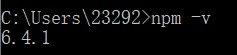

# 介绍

本项目是用gitbook + github page构建而成的.
对初学者来说,可以当作一份python入门学习指南.  


# 使用

您可以直接访问 [在线版](https://hubhack.cn/python-book/)，或者有的朋友网速不好, 可以根据以下步骤访问本地版。

## 前置条件

您的系统上需要安装好 [node](https://nodejs.org/zh-cn/).  
安装完成后,在cmd中输入npm-v,出现如下即为安装完成.   


## 使用 gitbook 命令(win10)

若您不能使用 make 命令，或想直接使用 gitbook 命令，执行如下命令进行初始化：

```console
npm i -g gitbook-cli #可能需要sudo
gitbook install
```

执行如下命令运行服务端：

```console
gitbook serve # 开启服务
```

## 访问

直接访问 http://localhost:4000 即可查看本书内容。

