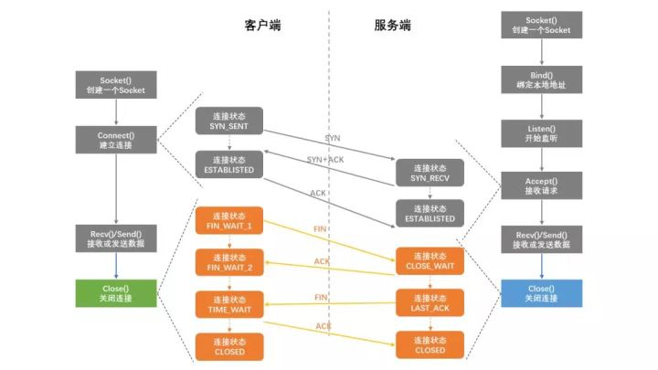

### socket(套接字)

socket白话就是插座, 端口就是插座上的孔,端口不能被其他进程占用, 抽象理解socket类似于操作某个IP地址上的某个端口达到点对点通信的目的, 需要绑定到某个具体的进程中和端口中.

socket原本代表unix上的原始套接字(Rawsocket)用于描述文件的内存镜像, 因为unix系统设计哲学是一切都是文件,所以后来的, 网络版的进程间通信就被冠名为文件描述符 file desciptor, 很多通讯协议的实现和源代码都能看到Socket*_fd这样的变量命名,也正是因为如此.

Socket811/1150/1151
是英特尔早期的指令集与硬件高速缓存的架构实现 同样也是基于`一些都是文件`的Unix系统设计思想 所以Socket也代表电子电气领域的硬件通信标准.本质上讲 **Socket是Unix系统设计的一种思想**

socket的诞生是为了应用程序能够更加方便的将数据经由传输层, 所以他本质就是对TCp/ip的运用进行了一层封装.socket理解为通信两端的端口,  就是两个进程 ,跨计算机它两要通信, 需要通过网络对接起来, 这就是socket的作用, socket就是指代承载这种通讯的系统资源的标识, 聊天的本质就是客户端socket和服务端socket通信的过程.

### 上下文(context)

多任务系统实现的关键在于暂停当前任务， 保存当前任务的现场、 选择下一个任务、恢复下一个任务的的现场，执行下一个任务.在计算机中, 一般我们不称为现场, 而是上下文.在深入理解操作系统中, 开篇就是信息 = 位 + 上下文.程序 = 指令 + 上下文.

指令序列的含义是固定的，在计算机中就是 pc 寄存器地址指向的值，也就是 cpu 要执行的指令。但是对于计算机的不同层次，上下文的含义也不尽相同。

- 对于 cpu来说，上下文就是，操作数寄存器、栈寄存器、状态寄存器等各类寄存器。
- 对于进程来说，上下文就是，寄存器、信号、分配的内存空间，文件描述符等各类由cpu 抽象的出来的硬件资源.
- 对于线程来说，上下文就是，寄存器，线程堆栈···
- 对于一个函数来说，上下文就是当前的命名空间。

保存上下文 切换运行程序 恢复上下文 重新进入程序。

### 文件描述符

文件描述符是Unix系统标识文件的int，Unix的哲学一切皆文件，所以各自资源（包括常规意义的文件、目录、管道、POSIX      IPC、socket）都可以看成文件。文件描述符是内核提供给用户来安全地操作文件的标识，不像指针，拥有了指针后你能随便改。拥有了描述符后，你只能传入描述符给特定的接口，实际操作由内核读取用户输入的参数后来安全地执行。在windows下,文件描述符相当于handle(句柄),   进程号pid就是一个handle,文件描述符 就是一个handle,系统调用号 任然是一个handle,句柄就是一种指向指针的指针.

最终目的是用来定位打开文件在内存的位置.

### 网络IO模型

网络IO的本质是socket的读取, socket在linux系统被抽象为流, IO可以理解为对流的操作, 对于一次IO访问,数据会先被拷贝到操作系统内核的缓冲区, 然后才会从操作系统内核的缓冲区拷贝到应用程序的地址空间, 所以一般会经历两个阶段:

等待所有数据都准备好或者一直在等待数据, 有数据的时候将数据拷贝到系统内核;

将内核缓存中数据拷贝到用户进程中;

同步阻塞IO(blocking) 

调这个函数不达目的不放弃.

非阻塞IO(nonblocking)

如果Io设备没有准备好, 立即返回ERROR, 进程不阻塞,用户可以再次发起系统调用, 数据从磁盘到内核空间,内核到用户空间 recvfrom阻塞, 第二阶段阻塞.异常是一种非正常结果,  同步,只拿到结果.

IO多路复用

关心事件的, 基于事件驱动IO, 所谓复用 找了个代理人,操作系统. io和硬件打交道.操作系统 监控IO事件, 事件到达,会直接通知你, 处理IO的能力, 监控多路, 

select应用, 一直轮询.效率低下.

Poll对select 对升级, 对文件描述符 限制改掉了.

信号驱动模型

需要开启套接字的信号驱动I/O功能，并通过sigaction系统调用安装一个信号处理函数。sigaction函数立即返回，我们的进程继续工作，即进程没有被阻塞。当数据报准备好时，内核会为该进程产生一个SIGIO信号，这样我们可以在信号处理函数中调用recvfrom读取数据报，也可以在主循环中读取数据报。无论如何处理SIGIO信号，这种模型的优势在于等待数据报到达期间不被阻塞

“面向流”就是源源不断地，分不清开始和结束的字节。每次的收发量不确定.

”面向报文“就是每次的收发都有最大的长度限制(即报文长度)，接收端每次都会接收到一个报文，也就能分清每次报文的开始和结束。