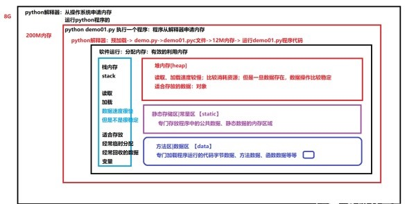

### 内存

内存其实就是连续的存储单元组成的,我们常见的额数据结构(二叉树,链表)在内存中的存储其实都是一个个安放的(物理结构),只是人为的我们赋予了不同的意义(逻辑结构).
内存条是cpu可通过总线寻址,并进行读写操作的电脑部件.

内存颗粒就是内存条上的几片较大集成块，颗粒数据是每片集成块的数据，与内存容量是一个倍数关系。

Python中所有小于256个字节的对象都使用pymalloc实现的分配器，而大的对象则使用系统的 malloc。另外Python对象，如整数，浮点数和List，都有其独立的私有内存池，对象间不共享他们的内存池。也就是说如果你分配又释放了大量的整数，用于缓存这些整数的内存就不能再分配给浮点数。

 

程序是以字节序列存储在文件中,

寄存器数据最快其次缓存和内存

在python3中,字符串就是unicode

python的内存模型

### unicode

为了统一所有文字的编码，Unicode应运而生。Unicode把所有语言都统一到一套编码里，这样就不会再有乱码问题了。

序列化:在python中的变量都是存在内存中的,可以随时修改变量名,但是一旦程序结束,变量所占用的内存就被操作系统全部回收,如果没有把修改后的名字存储到磁盘上,下次重新运行程序,变量又被初始化了,

把变量从内存中变成可存储或传输的过程叫序列化,在python叫picking

### 大小端

所谓大端模式即是内存的低地址空间存储数据的高位，高地址空间存储数据的低位；内存由低到高访问时，首先碰到的是数据的高位，类似于将数据当做字符串；而小端模式则刚好相反； 

小端是低位在低字节，高位在高字节；示例： 

0x12345678,在大端模式中，高位为0x12，在小端模式中，高位为0x78；注意均为1个字节；

指针即为地址，指针几个字节跟语言无关，

而是跟系统的寻址能力有关，

譬如以前是16为地址，指针即为2个字节，

现在一般是32位系统，所以是4个字节，

以后64位，则就为8个字节。

### 二进制

因为二进制是在电路中最好控制的,只有1和0两种状态,如果更多进制的话真不知电脑能怎么运行了.

在电脑中如果只是用一位位二进制来储存数据会比较麻烦,例如要储存一个整数15,要用四位二进制,200又要用8位二进制.那读取时这个数到底时多少位二进制呢.所以产生了字节,并规定8位进制数为一个字节,一个字节可表示0-255,一共256个数.如果储存的数大于255可以用两个字节表示.

这时如果十六进制来表示字节又会比十进制方便很多.因为用两位十六进制刚好可以表示一个字节,例如F0二进制就是11110000.高位十六进制和低位十六进制又刚好分别对应二进制中的前四位和后四位.

在磁盘上的文件从逻辑上是字节流.

从物理上根本不是连续的 大于扇区,按照512字节 

逻辑单位 最小4k 4096 8192

python程序在运行时会先像操作系统申请线性地址,从而开辟连续的空间.不用的对象就叫垃圾,是通过gc回收机制管理的.

有序和无序其实就是看有没有索引

线性非线性是看数据在内存中是否连续

可索引可迭代 可迭代不一定可索引,python报错subscriptable就是不可索引

python的数据类型转换是通过内建函数来完成的

python中的变量其实相当于C语言的指针,可修改的类型叫做值类型, 不可修改类型叫做引用类型

对象 = 确定内存空间 + 存储 

字节码编译,当程序执行时, python内部会先将源代码编译成所谓的字节码形式,编译是一个简单的翻译步骤, 而且字节码是源代码底层的,与平台无关的表现形式. .pyc就是编译过的py源码

### buffer

buffer, 缓冲, 缓冲就是两个模块之间的生产和消费速度不匹配,导致积压.queue就是干这个的,所以

Queue就是buffer,buffer其实就是Queue,buffer可以认为是一个队列深度很高的队列, 能容纳相当量的数据, 缓冲里的内容会在一定时间内迅速消耗掉,而不是长期呆在里面,否则就成了缓存.

数据的生产是不稳定的,可能会造成短时间数据的潮涌, 需要缓冲.

消费者消费能力不一样,有快有慢,消费者可以自己消费缓冲区中的数据,

单机时, 可以使用标准库queue模块的类来构建进程内的队列,满足多个线程间的生产消费需要.

大型系统可以使用第三方消息中间件--RabbitMQ, RocketMQ, Kafka等.

### Cache

缓存本质上是一块存储器, 追求速度的硬件中一般采用SRAM来充当,比如CPUde 各级缓存.不过追求速度的可以用DRAM来盛放.缓存可以兼顾缓冲的作用,数据往缓存里放.一般放置热点数据.经常被访问到的数据.

### Queue

队列用于两个模块之间传递消息,一般采用FIFO方式,在芯片内部，两个硬件模块（或者是CPU+固件，或者直接是组合逻辑电路）之间通常采用寄存器~寄存器对连的方式来传递数据/信号，但是寄存器对连的话，每次只能往寄存器里放一条数据，如果两端步调不一致，你处理快我处理慢的话，自然就有需求形成一个队列，那就是排布多个寄存器形成一列，然后再加上用于记录这一列寄存器中数据保存到什么位置的队列指针寄存器。生产者将消息从队列尾部入队，更新写指针，消费者从队列头部读走消息，更新读指针。队列的两个作用:解耦, 缓冲. queue类是线程安全的,适用于多线程间的安全的交换数据.内部使用了Lock 和 Condition.

