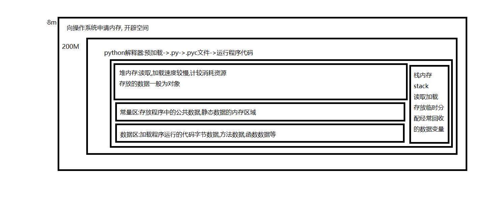

### 内存

内存其实就是连续的存储单元组成的,我们常见的额数据结构(二叉树,链表)在内存中的存储其实都是一个个安放的(物理结构),只是人为的我们赋予了不同的意义(逻辑结构).

计算机(程序)直接使用的数据保存在计算机的内存储器, 内存是cpu可以直接访问的数据存储设备,与之相对应的是外存储器.内存的基本结构是线性排列的一批存储单元,每个单元的大小相同,可以保存一个单位大小的数据,内存单元具有唯一编号,称为单元地址,或简称地址.单元地址从0开始排列,全部可用地址为从开始的一个连续的正整数空间.

程序是以字节序列存储在文件中,在程序执行中, 对内存单元的访问(存取其中数据)都通过单元的地址进行,因此,要访问一个地址,必须先掌握其地址,在许多计算机中,一次内存访问可以存取若干单元的内容,例如目前常见的64位计算机,一次存取8个字节的数据, 与单元的位置或整个内存的大小无关.

在计算机内存里表示数据元素之间的联系,只有两种技术:利用数据元素的存储位置隐式表示,由于内存是单元的线性序列,知道了前一个元素的位置及其大小,就能确定下一个元素的位置.如果存储的是一系列大小相同的元素,就可以利用前面公式直接算出序列中任何一个元素的位置.显然序列数据类型中元素的线性关系可以用这种方式表示.在文档管理的数学模型中,计算机处理的对象通常存在着一种最简单的线性关系, 这类数学模型可称为线性的数据结构.

python程序在运行时会先像操作系统申请线性地址,从而开辟连续的空间.不用的对象就叫垃圾,是通过gc回收机制管理的.

### python的内存模型

对象 = 确定内存空间 + 存储 



python的核心是一切皆对象,对于人的思维来说, 对象是一个比较形象的概念, 而对于计算机来说, 对象却是一个抽象的概念, 对于计算机来说, 他所知道的一切都是字节, 通常的说法是: 对象是数据以及基于这些数据的操作的集合, 在计算机中, 这都不重要, 重要的是这片内存在更高的层次.在Python中，对象就是为c中的结构体在堆上申请的一块内存，一般来说，对象是不能被静态初始化的，并且也不能在栈空间上生存．唯一的例外就是类型对象，Python中所有的内建的类型对象（如整数类型对象，字符串类型对象）都是被静态初始化的·在Python中，一个对象一旦被创建，它在内存中的大小就是不变的了.这就意味着那些需要容纳可变长度数据的对象只能在对象内维护一个指向一块可变大小的内存区域的指针。

### c语言4区

c语言4区 :代码区数据区,堆区栈区

 1.栈区：存放局部变量，用完由操作系统自动释放

2.堆区：动态分配给程序的内存区域，由程序员手动释放

3.数据区：分为两种：

（1）常量区：存放常量，一般是字符串常量

（2）全局区/静态区：存放全局变量和静态变量

4.代码区：存放可执行代码的区域

### 堆和栈

```
堆:是大家共有的空间, 分全局堆和局部堆.全局堆就是所有没有分配的空间，局部堆就是用户分配的空间。堆在操作系统对进程初始化的时候分配，运行过程中也可以向系统要额外的堆，但是记得用完了要还给操作系统，要不然就是内存泄漏。向高地址扩展的数据结构，是不连续的内存区域。因为系统是用链表来存储空闲内存地址的，且链表的遍历方向是由低地址向高地址。由此可见，堆获得的空间较灵活，也较大。栈中元素都是一一对应的，不会存在一个内存块从栈中间弹出的情况。
```

```
栈：是个线程独有的，保存其运行状态和局部自动变量的。栈在线程开始的时候初始化，每个线程的栈互相独立，每个函数都有自己的栈，栈被用来在函数之间传递参数。操作系统在切换线程的时候会自动的切换栈，就是切换寄存器。栈空间不需要在高级语言里面显式的分配和释放。向低地址扩展的数据结构，是一块连续的内存区域.
```

在很多现代操作系统中，一个进程的（虚）地址空间大小为4G，分为系统内核空间和用户空间两部分，系统空间为所有进程共享，而用户空间是独立的，一般WINDOWS进程的用户空间为2G。

一个进程中的所有线程共享该进程的地址空间，但它们有各自独立的（私有的）栈(stack)

 **栈和堆由什么控制？**

当线程被创建时操作系统分配的每个系统级线程的堆栈。通常堆是由 语言运行时即应用程序调用操作系统分配。

### 用户态和内核态

直观点说明吧，cpu你就想象成皇帝，（不能出宫私访），所谓内核空间你就想象成住在皇宫里面的皇帝周围的各种服务人员，侍卫，太监，宫女。（各种办公的官员退朝以后不能留在皇宫吧？当做不在好了）

用户空间，就是皇宫外面的做各种事情的官员以及办公场所，负责教育的，医疗的， 工程的，研究飞机的，导弹的，等等等等，总之，是不能进入皇宫的官员。

你有事可以直接找官员，官员再找太监告知皇上，皇上通过太监传旨给官员，官员才能完成你请求要做的事情。

你使用的各种电脑软件工具，浏览器啊，记事本啊，QQ啦，播放器啦，都是具体的和平民有接触的存在于用户空间的官员。 你用这些软件过程中使用到的磁盘啦，网卡，显示器，键盘按键，鼠标事件等等什么事情， 需要通过内核空间的太监向皇上请求，皇上CPU想好了以后，通过内核空间太监传旨给用户空间的官员来传达信息，官员才能做成你请求的事情。

当你在和官员往复交流的过程中， 叫用户态。

当皇上和太监交流的时候， 叫内核态。

当官员去请示皇上的时候，需要把材料交给太监，然后官员就在门口坐等，这个过程就是用户态到内核态的上下文切换。

### 引用计数

不用的对象就是垃圾,当对象的引用的计数器变为0的时候, 该对象可能在内存中,但是已经不能访问.python的垃圾回收不能做其他操作.如果一个对象的引用计数变为0的时候.python就去回收该对象.那么很显然python的效率会很差.那什么时候python会来回收呢?这是个好问题.

python会监听自己new了多少个新的对象和右多少对象的引用计数器变了, 两个数值做差得到的数阈值去比较,大于阈值, 内存开始进行垃圾回收,销毁引用计数器为0的对象.

优点:简单实时性, 缺点:维护引用计数消耗资源.循环引用.

### 分代回收

为了提高效率, 有很多对象, 清理了很多他依然存在,可以认为,这样的对象不需要经常回收.可以把它分到不同的集合.每个集合回收的时间间隔不同.简单的说这就是python的分代回收.

具体说一下,python中的垃圾分为1, 2, 3代.在1代里的对象每次回收都会去清理,当清理后有引用的对象依然存在, 此时他会进入2代集合.同理2代集合清理的时候存在的对象会进入2代集合.

每个集合的清理时间如何分配,会先清理1代垃圾,当清理10次一代垃圾后会清理一次2代垃圾,当清理10次2代垃圾后 会清理一次2代垃圾,当清理10次2代垃圾后会清理2代垃圾.

### 标记清除

按需分配,当内存不够的时候,从 寄存器和程序栈上的引用出发,遍历对象.将遍历的对象打上标记,然后再内存中清除没有标记的对象.

内存条是cpu可通过总线寻址,并进行读写操作的电脑部件.

内存颗粒就是内存条上的几片较大集成块，颗粒数据是每片集成块的数据，与内存容量是一个倍数关系。

Python中所有小于256个字节的对象都使用pymalloc实现的分配器，而大的对象则使用系统的 malloc。另外Python对象，如整数，浮点数和List，都有其独立的私有内存池，对象间不共享他们的内存池。也就是说如果你分配又释放了大量的整数，用于缓存这些整数的内存就不能再分配给浮点数。

### 序列化

在python中的变量都是存在内存中的,可以随时修改变量名,但是一旦程序结束,变量所占用的内存就被操作系统全部回收,如果没有把修改后的名字存储到磁盘上,下次重新运行程序,变量又被初始化了,

把变量从内存中变成可存储或传输的过程叫序列化,在python叫picking

### 大小端

所谓大端模式即是内存的低地址空间存储数据的高位，高地址空间存储数据的低位；内存由低到高访问时，首先碰到的是数据的高位，类似于将数据当做字符串；而小端模式则刚好相反.小端是低位在低字节，高位在高字节；示例： 0x12345678,在大端模式中，高位为0x12，在小端模式中，高位为0x78；注意均为1个字节.

在python3中,字符串就是unicode, Unicode把所有语言都统一到一套编码里，这样就不会再有乱码问题了。

### buffer

buffer, 缓冲, 缓冲就是两个模块之间的生产和消费速度不匹配,导致积压.queue就是干这个的,所以

Queue就是buffer,buffer其实就是Queue,buffer可以认为是一个队列深度很高的队列, 能容纳相当量的数据, 缓冲里的内容会在一定时间内迅速消耗掉,而不是长期呆在里面,否则就成了缓存.

数据的生产是不稳定的,可能会造成短时间数据的潮涌, 需要缓冲.

消费者消费能力不一样,有快有慢,消费者可以自己消费缓冲区中的数据,

单机时, 可以使用标准库queue模块的类来构建进程内的队列,满足多个线程间的生产消费需要.

大型系统可以使用第三方消息中间件--RabbitMQ, RocketMQ, Kafka等.

### Cache

缓存本质上是一块存储器, 追求速度的硬件中一般采用SRAM来充当,比如CPUde 各级缓存.不过追求速度的可以用DRAM来盛放.缓存可以兼顾缓冲的作用,数据往缓存里放.一般放置热点数据.经常被访问到的数据.

### Queue

队列用于两个模块之间传递消息,一般采用FIFO方式,在芯片内部，两个硬件模块（或者是CPU+固件，或者直接是组合逻辑电路）之间通常采用寄存器~寄存器对连的方式来传递数据/信号，但是寄存器对连的话，每次只能往寄存器里放一条数据，如果两端步调不一致，你处理快我处理慢的话，自然就有需求形成一个队列，那就是排布多个寄存器形成一列，然后再加上用于记录这一列寄存器中数据保存到什么位置的队列指针寄存器。生产者将消息从队列尾部入队，更新写指针，消费者从队列头部读走消息，更新读指针。队列的两个作用:解耦, 缓冲. queue类是线程安全的,适用于多线程间的安全的交换数据.内部使用了Lock 和 Condition.


1、为什么python语言明明没有变量声明，却是强类型语言？python是如何检查类型的？

因为python语言可以通过对象的PyObject指针获得他们类型信息，从而检查他们的类型。反观c语言，尽管有类型声明，然而c语言并没有检查他们变量类型的手段，或者换句话说，c语言中存储的值不记录他们自身的类型信息。

2、为什么list，dict等容器可以随意嵌套，如此灵活？

因为对于这些容器来说，他们存放的只是对象引用，也就是PyObject指针，无论存放什么对象对容器来说毫无区别。不难猜想，简单地利用c语言中的数组，就可以实现python中的list。

3、类的方法第一个参数是它自身，如何实现？

简单啊，在方法的struct中加一个记录自己所属类的成员变量就可以了。