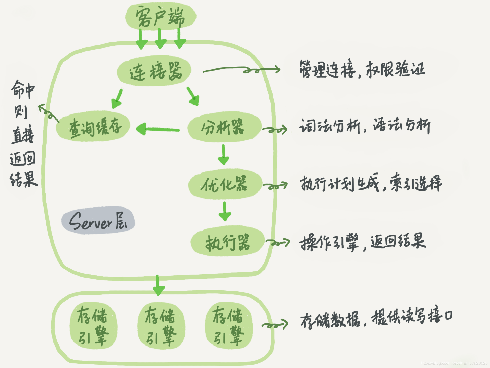

### sql语句

sql是结构化查询语句structured Query Language. 1987年被ISO组织标准化.

所有主流的关系型数据库都支持SQL, NoSQL也有很大一部分支持SQL.

```
DDL数据定义语句, 负责数据库定义, 数据库对象定义, 有CREATE, ALTER与DROP三个语法所组成.
DML数据操作语言, 负责对数据库对象的操作, CRUD增删改查.
DCL数据控制语言,负责数据库权限访问控制, 由GRANT和REVOKE两个指令组成.
TCL事务控制语言, 负责处理ACID事务, 支持commit, rollback指令.
```

### 语言规范

SQL语句大小写不敏感,一般建议, SQL的关键字, 函数等大写.,SQL语句末尾应该使用分号结束.

注释,多行注释/\*注释内容\*/,单行注释--注释内容,MYSQL 注释可以使用#,使用空格或缩进来提高可读性.命名规范,必须以字母开头,可以使用数字, #,$和_,不可使用关键字.


DBMS是管理数据库的系统软件, 它实现数据库系统的各种功能.是数据库系统的核心.

DBA:负责数据库的规划,设计,协调,维护和管理等工作.

应用程序指以数据库为基础的应用程序.

对于mysql数据库而言, 数据是存储在文件里的, 而为了能够快速定位到某张表里的某条记录进行查询和修改,我们需要将这些数据已一定的数据结构进行存储,这个数据结构进行存储,这个数据结构就是我们说的索引.数组要求插入的时候保证有序, 这样查找的时候可以利用二分查找法达到O(logn)的时间复杂度O(N).所以有序数组只适合存储静态数据,例如几乎很少变动的配置数据,或者是历史数据,

磁盘io是一个相对很慢的操作,为了提高读取数据,我们应该尽量减少磁盘io操作.而操作系统一般以4kb为一个数据页读取数据, 而mysql一般为16kb作为一个数据块,已经读取的数据块会在内存中进行缓存,如果多次数据读取在同一个数据块,则只需要一次磁盘io,而如果顺序一致的记录在文件也是顺序存储的,就可以一次读取多个数据块,这样范围查询的速度也可以大大提升,显然链表没有这方面的优势.

### 关系

在关系型数据库中, 关系就是二维表,有行和列组成.

行Row,也称为记录record, 元组.列column, 也称为字段field, 属性.字段的取值范围叫做域domain.

维数:关系的维数指关系中属性的个数.      基数:元组的个数.

注意在关系中, 属性的顺序并不重要,理论上,  元组顺序也不重要,但是由于元组顺序与存储相关,会影响效率.

**候选键:关系中,能唯一标识一条元组的属性或属性集合.称为候选键.**

**主键:表中一列或者多列组成唯一的key,也就是通过这一个或者多个列能唯一的标识一条记录, 几倍选择的候选键.主键的列不能包括空值null, 主键往往设置为整型, 长整型.且自增.表中可以没有主键, 但是, 一般表设计中, 往往都会有主键, 以避免记录重复.**

**外键:严格来说, 当一个关系中的某个属性或属性集合与另一个关系的候选键匹配时, 就称为这个属性或属性集合时外键.**

**索引Index:可以看做是一本字典的目录, 为了快速检索用的, 空间换时间, 显著提高查询效率.可以对一列或者多列字段设定索引.**

```
主键索引, 主键会自动建立主键索引, 主键本身就是为了快速定位唯一记录的,

唯一索引, 表中的索引列组成的索引必须唯一, 但可以为空, 非空值必须唯一. 

普通索引, 没有唯一性的要求, 就是建了一个字典的目录而已,
```

**约束**:为了保证数据的完整正确, 数据模型还必须支持完整性约束, 必须有值约束.某些列的值必须有值, 不许为空null.

**域约束**:限定了表中字段的取值范围,

**实体完整性,** 主键约束定义了主键, 就定义了主键约束, 主键不重复且唯一, 不能为空. 

**引用完整性,** 外键定义中, 可以不是引用另一张表的主键,但是, 往往实际只会关注引用主键.

**外键**:在表中的列, 引用了表中的主键, 表b中列就是外键.a表称为主表, b表称为从表.

**视图**:也称虚表, 看起来像表, 它是由查询语句生成的,可以通过视图进行crud操作.

简化操作, 将复杂查询sql语句定义为视图, 可以简化查询.

数据安全, 视图可以只显示真实表的部分列, 或计算后的结果. 从而隐藏真实表的数据.

关系:在关系数据库中, 关系就是二维表,.

关系操作就是对表的操作.

```
选择:又称为限制. 是从关系中选择出满足给定条件的元组.

投影:在关系上投影就是从选择出若干属性列组成新的关系,

连接 : 将不同的两个关系连接成一个关系.
```

外键约束的操作

| 设定值    | 说明                                                         |
| --------- | ------------------------------------------------------------ |
| CASCADE   | 级联,从父表删除或更新会自动删除或更新子表中匹配的行          |
| SET NULL  | 从父表删除或更新行,会设置子表中的外键列为NULL,但必须保证子表列没有NOT NULL, 也就是说子表的字段可以为NULL才行. |
| RESTRICT  | 如果从父表删除主键, 如果子表引用了, 则拒绝对父表的删除或更新操作 |
| NO ACTION | 标准SQL的关键字, 在MYSQL中REATRICT相同.拒绝对父表的删除或更新操作 |

外键约束,是为了保证数据完整性, 一致性, 杜绝数冗余, 数据错误.

实体-联系E-R

数据库建立, 需要收集用户需求,设计符合企业要求的数据模型. 而构建这种模型需求方法.这种方法需要成为E-R实体-联系建模. 也出现了一种建模语言 ---- UML(Unified Modeling Language)统一建模语言.

实体Entry:现实世界中具有相同属性的一组对象, 可以是物理存在的事务或抽象的事物.

联系relationship: 实体之间的关联集合.

### mysql共享锁与排他锁

锁是计算机协调多个进程或线程并发访问某一资源的机制.锁保证数据并发访问的一致性,有效性;锁冲突也是影响数据库并发访问性能的一个重要因素.锁是mysql在服务器层和存储引擎层的并发控制.

加锁是消耗资源的, 锁的各种操作,包括获得锁,检测锁是否已解除,释放锁等.

共享锁与排他锁

* 共享锁(读锁): 其他事务可以读, 但不能写.
* 排他锁(写锁): 其他事务不能读取, 也不能写

### sql执行过程




范式理论 - 设计二维表的指导思想

1.第一范式: 数据表的每个列的值域都是由原子值组成的, 不能够再分割.

2.第二范式: 数据表里的所有数据都要和该数据表的键(主键与候选键)有完全依赖关系.

3.第三范式: 所有非键属性都只和候选键有相关性,也就是说非键属性之间应该是独立无关的.


数据完整性

实体完整性 - 每个实体都是独立无二的.

- 主键(primary key) /唯一约束 / 唯一索引

引用完整性(参照完整性) - 关系中不允许引用不存在的实体

- 外键(foreign key)

域完整性 - 数据是有效的

- 数据类型及长度
- 非空约束
- 默认值约束
- 检查约束


数据一致性

事务: - 一系列对数据库进行读/写的操作

事务的ACID特性

- 原子性: 事务作为一个整体被执行. 包含在其中的对数据库的操作要么全部被执行, 要么都不执行
- 一致性: 事务因确保数据库的状态从一个一致状态转变为另一个一致状态
- 隔离性:多个事务并发执行时, 一个事务的执行不应影响其他事务的执行
- 持久性: 已被提交的事务对数据库的修改应该永久保存在数据库中.

### DML -- CRUD 增删改查

#### insert语句

```
INSERT INTO table_name(col_name,...) VALUES(values,...)
-- 向表中插入一行数据, 自增字段, 缺省值字段, 可为 空字段可以不写
INSERT INTO table_name SELECT ...;
-- 将select查询的结果插入到表中
INSERT INTO table_name (col_name1,...) VALUES (values,...) On DUPLICATE KEY UPDATE
-- 如果主键冲突,唯一键冲突就执行update后的设置, 这条语句的意思, 就是主键不在新增记录, 主键在就更新部分字段
INSERT IGNORE INTO table_name (col_name,...) VALUES (value1,...);
-- 如果主键冲突,唯一键冲突就忽略错误, 返回一个警告
```

updata语句


delete语句


### SQL SELECT语句

SELECT语句用于从数据库中选取数据, 结果被存储在一个结果表中, 称为结果集
数据库中数据的提取(查询)使用select 语法，主要有以下几点作用
* 提取的数据（搜索）
* 提取的数据进行排序（排序）
* 执行计算或汇总
语法:
```
Select  列名1,列名2    ← 查询要显示的列结果
From  表名            ← 数据库中表名
Where  查询条件       ← 条件表达式
```
**SQL编写顺序与逻辑视图生成过程**

```
Select  名称,部门,电话  ←  步骤三   生成最终逻辑视图
From    员工信息表       ←  步骤一   生成全表逻辑视图
Where   职务=职员       ←  步骤二   生成符合条件的逻辑视图
```

**多表信息查询表达方法**

```
Select  表1.列名, 表2.列名  ←  选择要表示的列
From    表1, 表2            ←  要合并查询的表
Where   表1.ID1=表2.ID1     ←   多表连接条件
```

当多个表进行联合查询的时候,会发生一张表(A)中的数据行乘以别一张表(B)中的数据行,也就是A*B=所有查询数据.该结果产生的合并表数据被我们称为笛卡儿积.通常笛卡儿积会产生很多重复行的数据,我们要使用连接条件也就是A表和B表中指定的连接列来过滤掉重复和多余的笛卡儿积.
**SQL编写顺序与逻辑视图生成过程**

```
Select 人员信息表.人员名称,                     ←  步骤四  选择列
部门信息表.部门简称,
人员信息表.部门名称,
人员信息表.性别, 人员信息表.电话
From  人员信息表,部门信息表                    ←  步骤一  合并表数据 
Where 人员信息表.部门ID=部门信息表. 部门ID      ←  步骤二  选择部门ID相等行
And   部门信息表.部门简称=财务                   ←  步骤三  选择部门名称为财务的行
```


**总结**
通过上面的介绍,我们知道了数据库在执行查询SQL计划时逻辑视图变化过程.我们在编写查询计划的时候,需要按照逻辑视图变化过程来编写,先写from 再写where最后select这个顺序.在多表的时候,需要where 来指定表的接合条件来过滤笛卡儿积.
**多表合并查询时候的内连接与外连接**

在上面我们使用多表查询的时候,对笛卡儿积的处理是使用where 加列连接条件.这种方法也被称为隐性连接.在SQL标准语句中有一种from 从句的扩展方法可以直接完成上面的功能. 这种从句的扩展方法也被成为显性内连接.关键字为 inner join on后边指定连接条件。

inner join表达方式

```
Select  表1.列名, 表2.列名       ←   要选择的列
From    表1 inner join 表2  on  表1.ID1=表2.ID1     
Where   行选择条件
```

From 可以通过内连接直接获得到要得到的数据结果,而不产生笛卡儿积现象
SELECT *
FROM  人员信息表,部门信息表                     
WHERE 人员信息表.部门ID=部门信息表.部门ID


我们也可以通过上面where列连接条件的方法得到一个内连接(inner join on)相同的数据结构.可以说where列连接连接和(inner join on) 都是内连接.where是隐性连接, (inner join on)为显性连接, 大家可以根据个人习惯来选择那种方式来进行多表连接.

```
内连接分为2中连接方法
1 显性连接, FROM INNER JOIN ON
2 隐性连接, where 列的关联条件
```


在低版本数据库中,显性连接和隐性连接执行效率会有差别,在现在的数据库基本没有区别.完全根据个人习惯或者项目要求来选择哪种连接方式.

**外连接**
虽然我们学会使用了内连接,但是还有很多复杂情况内连接无法解决.SQL还给我们提供了一种连接方法叫外连接.在外连接的表合并过程中,我们要定义一个驱动表,以驱动表为基础与其他表进行多表合并的过程叫外连接. 外连接分为左连接和右连接,
显性连接 from (LEFT JOIN ON 列连接条件 ,RIGHT JOIN ON列连接条件)
隐性连接 where 列连接条件(+)=列连接条件,列连接条件=列连接条件(+) 表示.
SQL表达方式

```
显性连接
SELECT  *
FROM   表1 (left or right) join 表2  on  表1.ID1=表2.ID1     
WHERE  选择行条件
```

隐性连接

```
SELECT * 
FROM 表1, 表2
WHERE 表1.id1 = 表2.id2(+) and 选择行条件
或者 表1.id1(+)=表2.id and 选择行条件
```

子查询
我们已提及每个表表达式的值都是有一组行构成.如果我们将表表达式放入到from中在有from生成一个表表达式.而这个重新生成的过程叫做子查询.

```
SELECT  人员表1.人员名称  
FROM    ( select 名称,性别             ← 生成一个年龄小于30中间结果表(表表达式)
From  人员信息表             
Where  年龄<30 )  人员表1   ← 上面的表表达式可以在放入一个FROM中进行处理
Where     人员表1.性别=女
```

表表达式是在FROM 中进行从新定义和处理的.

```
SELECT * 
FROM ( SELECT * FROM (
SELECT * FROM(
SELECT * FROM 人员信息表) AS A3) AS A2 )AS  A1
表表达式允许这样嵌套下去.
```

**Group by**

Group by 为分组查询关键字.通过from得到中间结果表, 在中间结果表中某一个列有很多重复的数据.我们希望将这些重复的数据合并成一个数据行, 那么group by就可以帮助我们把这个列中的重复数据合并层一条,而这一条原来对应的其他行数据都合并在一个行中. 分组查询就是将中间表信息改为行表达式.在使用聚合函数将复合条件的行表达式转换成标量达式.

**Having 分组判断**
Having功能和使用方法和where很像, 它主要的作用范围是在分组后产生的行中, 这些行中, 有的列单元中出现复合行.我们可以使用Having来对这写有复合行的列进行判断和筛选.

SELECT    名称,SUM(工资金额)    ← 将同一行中的工资金额聚合..
FROM      人员工资表          
Group by   名称                   	← 将有相同名称的人员进行分组
Having    SUM(工资金额)>4000    ←  判断那些分组后的行复合条件


